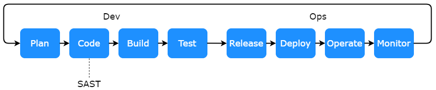

# Welcome! 

Welcome to this DevSecOps tutorial on *static application security testing* ([SAST](https://en.wikipedia.org/wiki/Static_application_security_testing)) with [Gosec](https://github.com/securego/gosec).

# Intended Learning Outcomes

In this tutorial you will learn:

- What SAST is, why it is used, and how it can be used to automatically identify security vulnerabilities early in a DevSecOps workflow.

- How to use the SAST tool *Gosec*, designed for the Go programming language.

- How to integrate *Gosec* with GitHub Actions.

Before starting the tutorial we will first give some background information on SAST and *Gosec*, followed by a motivation. 

The first part of the tutorial will then cover installation of *Gosec*. You will then be guided through various use cases to understand the capabilities of the tool. Finally, you will learn how *Gosec* can be integrated with GitHub Actions to automatically scan the GitHub repository for security vulnerabilities when new code is commited. 

# Static Application Security Testing (SAST)

The idea of SAST is to statically analyze source code in order to find security vulnerabilities. SAST is performed without having to build and execute the project, so it is generally integrated in the code phase of DevOps (see figure below), allowing for quick feedback to the developers. 

There are many different SAST tools out there for different programming languages. SAST is often a part of DevSecOps pipelines as it is one of the cheapest and fastest ways to detect security vulnerabilities automatically. 

# Gosec

*Gosec* is a SAST tool designed for the Go programming language. It works by scanning the *abstract syntax tree* (AST) and the *static single assignment* (SSA) representations of the source code. It can identify a list of common vulnerabilities such as the use of broken hash functions and potential SQL injection vectors.

> Press *START* when you are ready to continue!