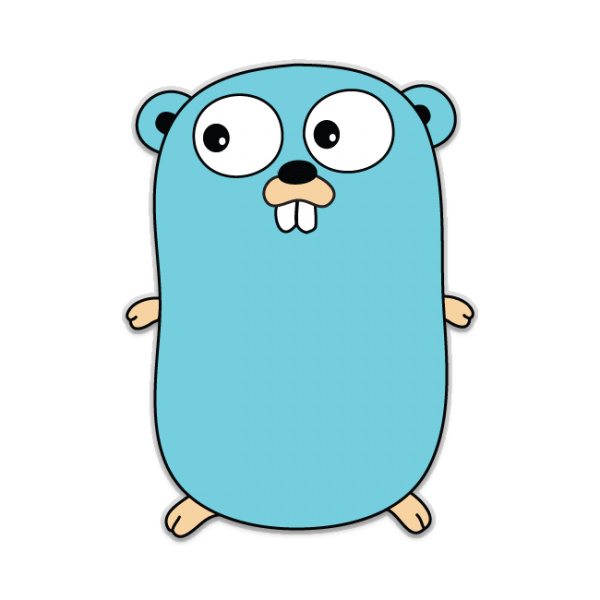

# Welcome! 

Welcome to this DevSecOps tutorial on *static application security testing* ([SAST](https://en.wikipedia.org/wiki/Static_application_security_testing)) with [gosec](https://github.com/securego/gosec).

# Intended Learning Outcomes

In this tutorial you will learn what SAST is and why it is important in a DevOps workflow to automatically identify security vulnerabilities. You will also learn how to use *gosec*, a SAST tool that can scan projects written in the Go programming language.

The first part of the tutorial covers the installation of *gosec*. You will then be guided through various use cases in order to learn the capabilities of the tool.

Finally, you will learn how *gosec* can be integrated with a GitHub Actions CI workflow to automatically scan a Go project every time new code is commited to the GitHub repository.

# Static Application Security Testing (SAST)

The idea of SAST is to statically analyze source code in order to find security vulnerabilities. SAST is performed without having to build and execute the project, so it is generally integrated in the code phase of DevOps (see figure below), allowing for quick feedback to the developers. 

There are many different SAST tools out there for different programming languages. *Gosec* is one such tool for the Go programming language. SAST tools are often integrated in DevSecOps pipelines as it is one of the cheapest and fastest ways to detect security vulnerabilities automatically. 

> Press *start* when you are ready to continue!